<h1 align="center">CG-EDITOR</h1>

### INSTALL DEPENDENCIES

```sh
pnpm install
```

### RUN PROJECT

```sh
# development
pnpm dev

# production
pnpm build
# then run
pnpm --filter cg-editor start
```
### ALPHABET

<div align="center">

<table cellpadding="10" cellspacing="0" align="center">
  <tr>
    <td align="center">A</td>
    <td align="center">B</td>
    <td align="center">C</td>
    <td align="center">D</td>
    <td align="center">E</td>
  </tr>
  <tr>
    <td align="center"><picture><source media="(prefers-color-scheme: dark)" srcset="assets/dark/A.svg"/></picture></td>
    <td align="center"><picture><source media="(prefers-color-scheme: dark)" srcset="assets/dark/B.svg"/></picture></td>
    <td align="center"><picture><source media="(prefers-color-scheme: dark)" srcset="assets/dark/C.svg"/></picture></td>
    <td align="center"><picture><source media="(prefers-color-scheme: dark)" srcset="assets/dark/D.svg"/></picture></td>
    <td align="center"><picture><source media="(prefers-color-scheme: dark)" srcset="assets/dark/E.svg"/></picture></td>
  </tr>
</table>

<table cellpadding="10" cellspacing="0" align="center">
  <tr>
    <td align="center">F</td>
    <td align="center">G</td>
    <td align="center">H</td>
    <td align="center">I</td>
    <td align="center">J</td>
  </tr>
  <tr>
    <td align="center"><picture><source media="(prefers-color-scheme: dark)" srcset="assets/dark/F.svg"/>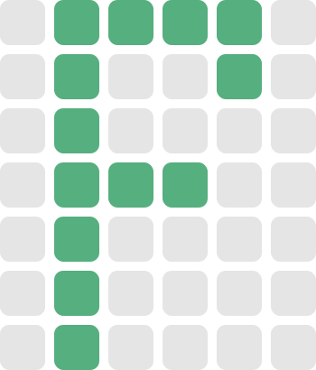</picture></td>
    <td align="center"><picture><source media="(prefers-color-scheme: dark)" srcset="assets/dark/G.svg"/>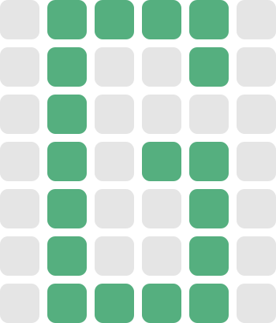</picture></td>
    <td align="center"><picture><source media="(prefers-color-scheme: dark)" srcset="assets/dark/H.svg"/></picture></td>
    <td align="center"><picture><source media="(prefers-color-scheme: dark)" srcset="assets/dark/I.svg"/>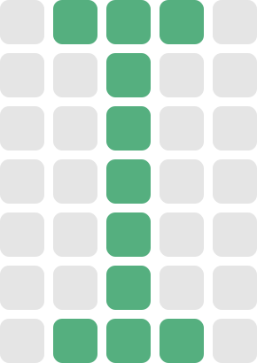</picture></td>
    <td align="center"><picture><source media="(prefers-color-scheme: dark)" srcset="assets/dark/J.svg"/>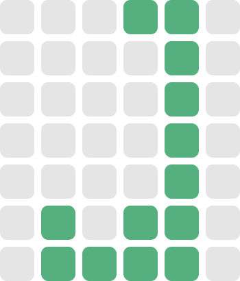</picture></td>
  </tr>
</table>

<table cellpadding="10" cellspacing="0" align="center">
  <tr>
    <td align="center">K</td>
    <td align="center">L</td>
    <td align="center">M</td>
    <td align="center">N</td>
    <td align="center">O</td>
  </tr>
  <tr>
    <td align="center"><picture><source media="(prefers-color-scheme: dark)" srcset="assets/dark/K.svg"/></picture></td>
    <td align="center"><picture><source media="(prefers-color-scheme: dark)" srcset="assets/dark/L.svg"/>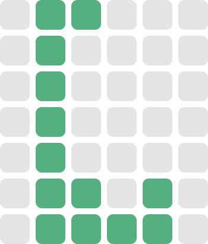</picture></td>
    <td align="center"><picture><source media="(prefers-color-scheme: dark)" srcset="assets/dark/M.svg"/></picture></td>
    <td align="center"><picture><source media="(prefers-color-scheme: dark)" srcset="assets/dark/N.svg"/></picture></td>
    <td align="center"><picture><source media="(prefers-color-scheme: dark)" srcset="assets/dark/O.svg"/>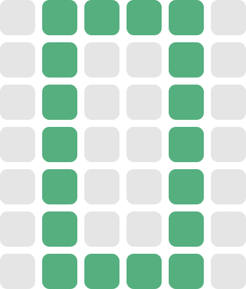</picture></td>
  </tr>
</table>

<table cellpadding="10" cellspacing="0" align="center">
  <tr>
    <td align="center">P</td>
    <td align="center">Q</td>
    <td align="center">R</td>
    <td align="center">S</td>
    <td align="center">T</td>
  </tr>
  <tr>
    <td align="center"><picture><source media="(prefers-color-scheme: dark)" srcset="assets/dark/P.svg"/>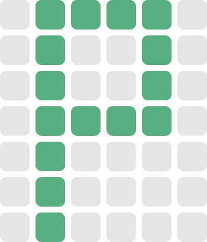</picture></td>
    <td align="center"><picture><source media="(prefers-color-scheme: dark)" srcset="assets/dark/Q.svg"/></picture></td>
    <td align="center"><picture><source media="(prefers-color-scheme: dark)" srcset="assets/dark/R.svg"/>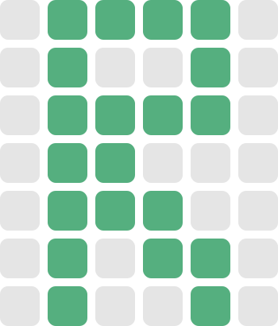</picture></td>
    <td align="center"><picture><source media="(prefers-color-scheme: dark)" srcset="assets/dark/S.svg"/>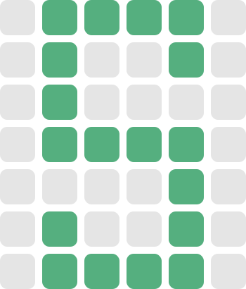</picture></td>
    <td align="center"><picture><source media="(prefers-color-scheme: dark)" srcset="assets/dark/T.svg"/>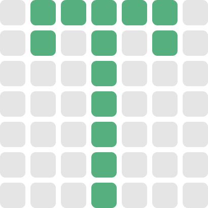</picture></td>
  </tr>
</table>

<table cellpadding="10" cellspacing="0" align="center">
  <tr>
    <td align="center">U</td>
    <td align="center">V</td>
    <td align="center">W</td>
    <td align="center">X</td>
    <td align="center">Y</td>
    <td align="center">Z</td>
  </tr>
  <tr>
    <td align="center"><picture><source media="(prefers-color-scheme: dark)" srcset="assets/dark/U.svg"/></picture></td>
    <td align="center"><picture><source media="(prefers-color-scheme: dark)" srcset="assets/dark/V.svg"/></picture></td>
    <td align="center"><picture><source media="(prefers-color-scheme: dark)" srcset="assets/dark/W.svg"/></picture></td>
    <td align="center"><picture><source media="(prefers-color-scheme: dark)" srcset="assets/dark/X.svg"/>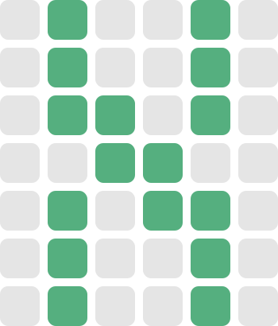</picture></td>
    <td align="center"><picture><source media="(prefers-color-scheme: dark)" srcset="assets/dark/Y.svg"/>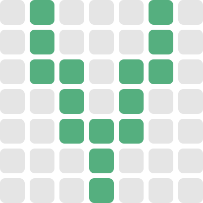</picture></td>
    <td align="center"><picture><source media="(prefers-color-scheme: dark)" srcset="assets/dark/Z.svg"/></picture></td>
  </tr>
</table>

<table cellpadding="10" cellspacing="0" align="center">
  <tr>
    <td colspan="5" align="center"><strong>SYMBOLS</strong></td>
  </tr>
  <tr>
    <td align="center">❤︎</td>
  </tr>
  <tr>
    <td align="center"><picture><source media="(prefers-color-scheme: dark)" srcset="assets/dark/❤︎.svg"/></picture></td>
  </tr>
</table>
</div>

### AUTHOR

-  **NV-Phong**
-  Email: `nv.phong.dev@gmail.com`