<h1 align="center">CG-EDITOR</h1>

### INTRODUCE

This Contribution Graph Editor, built with NextJS, provides an intuitive interface with auto-commit functionality.

### INSTALL DEPENDENCIES

```sh
pnpm install
```

### RUN PROJECT

```sh
# development
pnpm dev

# production
pnpm start
```
### ALPHABET

<div align="center">

<table cellpadding="10" cellspacing="0" align="center">
  <tr>
    <td align="center">A</td>
    <td align="center">B</td>
    <td align="center">C</td>
    <td align="center">D</td>
    <td align="center">E</td>
  </tr>
  <tr>
    <td align="center">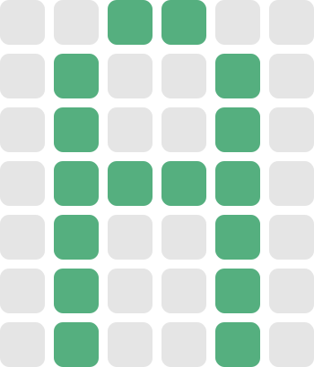</td>
    <td align="center">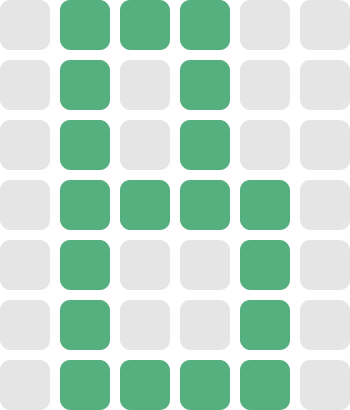</td>
    <td align="center">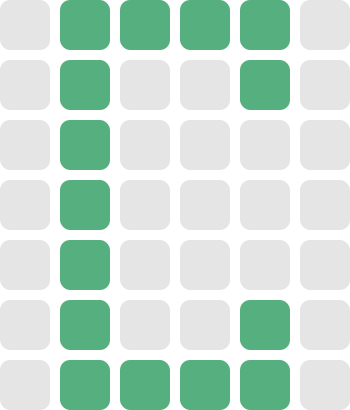</td>
    <td align="center">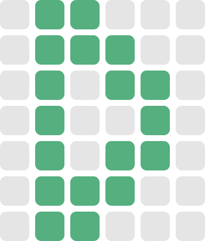</td>
    <td align="center">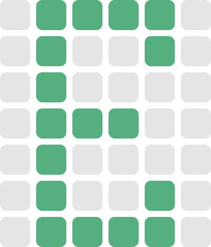</td>
  </tr>
</table>

<table cellpadding="10" cellspacing="0" align="center">
  <tr>
    <td align="center">F</td>
    <td align="center">G</td>
    <td align="center">H</td>
    <td align="center">I</td>
    <td align="center">J</td>
  </tr>
  <tr>
    <td align="center"></td>
    <td align="center"></td>
    <td align="center">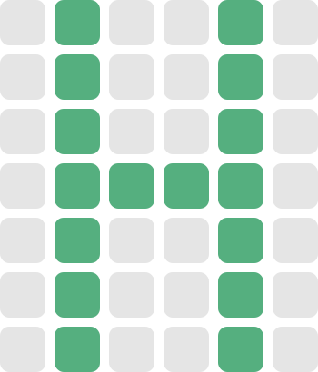</td>
    <td align="center"></td>
    <td align="center"></td>
  </tr>
</table>

<table cellpadding="10" cellspacing="0" align="center">
  <tr>
    <td align="center">K</td>
    <td align="center">L</td>
    <td align="center">M</td>
    <td align="center">N</td>
    <td align="center">O</td>
  </tr>
  <tr>
    <td align="center">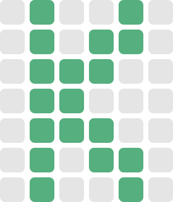</td>
    <td align="center"></td>
    <td align="center">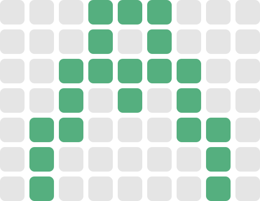</td>
    <td align="center">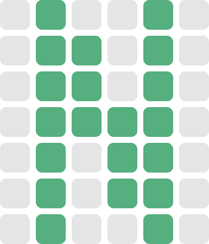</td>
    <td align="center"></td>
  </tr>
</table>

<table cellpadding="10" cellspacing="0" align="center">
  <tr>
    <td align="center">P</td>
    <td align="center">Q</td>
    <td align="center">R</td>
    <td align="center">S</td>
    <td align="center">T</td>
  </tr>
  <tr>
    <td align="center"></td>
    <td align="center">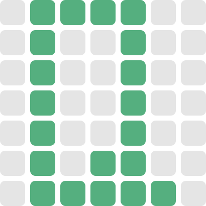</td>
    <td align="center"></td>
    <td align="center"></td>
    <td align="center"></td>
  </tr>
</table>

<table cellpadding="10" cellspacing="0" align="center">
  <tr>
    <td align="center">U</td>
    <td align="center">V</td>
    <td align="center">W</td>
    <td align="center">X</td>
    <td align="center">Y</td>
    <td align="center">Z</td>
  </tr>
  <tr>
    <td align="center">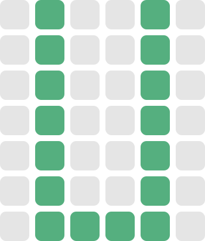</td>
    <td align="center">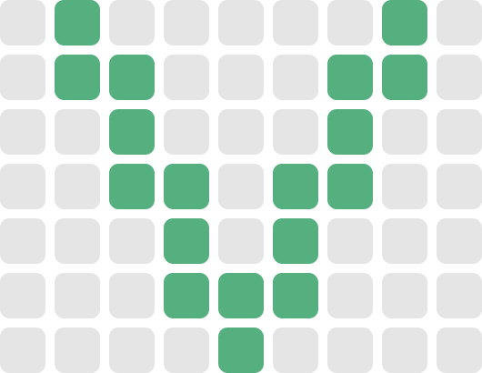</td>
    <td align="center">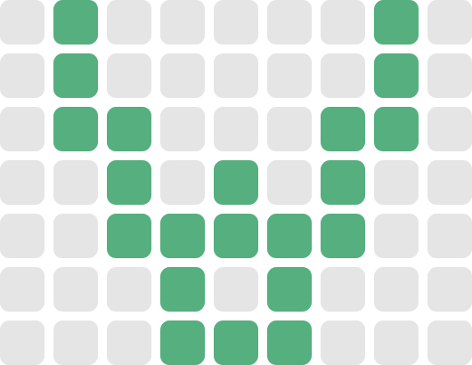</td>
    <td align="center"></td>
    <td align="center"></td>
    <td align="center">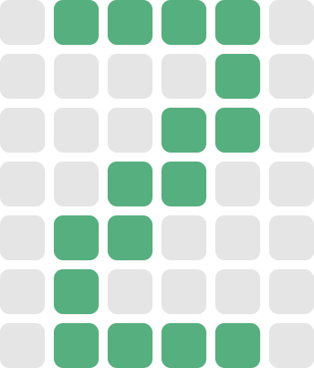</td>
  </tr>
</table>

<table cellpadding="10" cellspacing="0" align="center">
  <tr>
    <td colspan="5" align="center"><strong>SYMBOLS</strong></td>
  </tr>
  <tr>
    <td align="center">❤︎</td>
  </tr>
  <tr>
    <td align="center">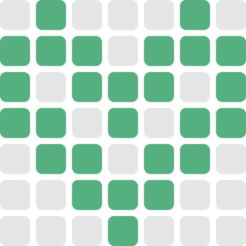</td>
  </tr>
</table>
</div>

### AUTHOR

-  **NV-Phong**
-  Email: `nv.phong.dev@gmail.com`